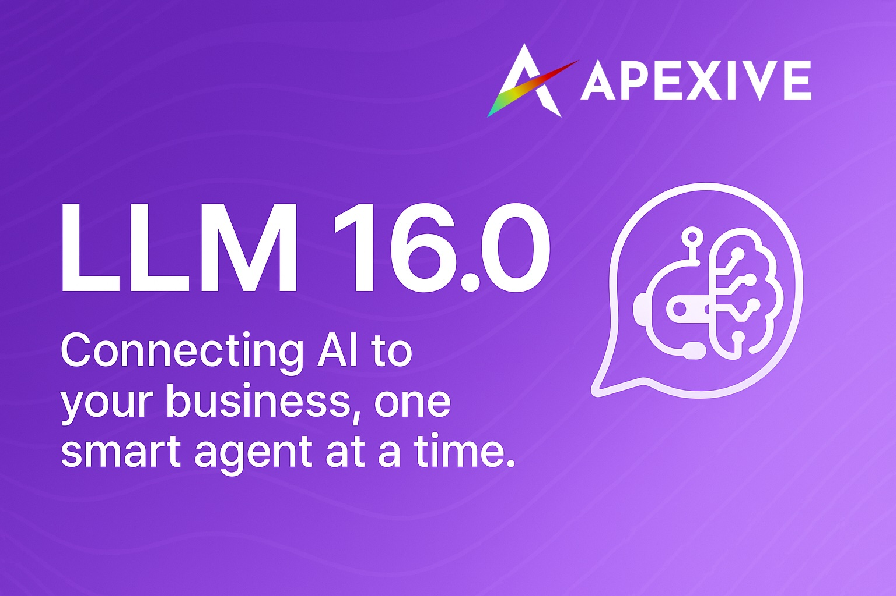

# Odoo LLM Integration



This repository provides a comprehensive framework for integrating Large Language Models (LLMs) into Odoo. It allows seamless interaction with various AI providers including OpenAI, Anthropic, Ollama, and Replicate, enabling chat completions, text embeddings, and more within your Odoo environment.

## 🚀 Latest Updates (Version 16.0-pr)

### **Major Architecture Improvements**
- **Consolidated Architecture**: Merged `llm_prompt` functionality into `llm_assistant` for streamlined prompt and assistant management
- **Performance Optimization**: Added indexed `llm_role` field for 10x faster message queries and improved database performance  
- **Unified Generation API**: New `generate()` method provides consistent content generation across all model types (text, images, etc.)
- **Enhanced Tool System**: Simplified tool execution with structured `body_json` storage and better error handling
- **PostgreSQL Advisory Locking**: Prevents concurrent generation issues with proper database-level locks

### **Developer Experience Enhancements**
- **Cleaner APIs**: Simplified method signatures with `llm_role` parameter instead of complex subtype handling
- **Better Debugging**: Enhanced logging, error messages, and migration scripts throughout the system
- **Reduced Dependencies**: Eliminated `llm_mail_message_subtypes` module by moving functionality to base `llm` module

## 🚀 Features

- **Multiple LLM Provider Support**: Connect to OpenAI, Anthropic, Ollama, Mistral, Replicate, LiteLLM, and FAL.ai.
- **Unified API**: Consistent interface for all LLM operations regardless of the provider.
- **Modern Chat UI**: Responsive interface with real-time streaming, tool execution display, and assistant switching.
- **Thread Management**: Organize and manage AI conversations with context and related record linking.
- **Model Management**: Configure and utilize different models for chat, embeddings, and content generation.
- **Knowledge Base (RAG)**: Store, index, and retrieve documents for Retrieval-Augmented Generation.
- **Vector Store Integrations**: Supports ChromaDB, pgvector, and Qdrant for efficient similarity searches.
- **Advanced Tool Framework**: Allows LLMs to interact with Odoo data, execute actions, and use custom tools.
- **AI Assistants with Prompts**: Build specialized AI assistants with custom instructions, prompt templates, and tool access.
- **Content Generation**: Generate images, text, and other content types using specialized models.
- **Security**: Role-based access control, secure API key management, and permission-based tool access.

## 📦 Modules

| Module                     | Version | Description                                                              |
|----------------------------|---------|--------------------------------------------------------------------------|
| `llm`                      | 16.0.1.3.0 | Base module with core functionality, message subtypes, and provider framework |
| `llm_anthropic`            | 16.0.1.1.0 | Anthropic (Claude) provider integration                                |
| `llm_assistant`            | 16.0.1.4.0 | **Enhanced**: Assistant management with integrated prompt templates and testing |
| `llm_chroma`               | 16.0.1.0.0 | ChromaDB vector store integration                                        |
| `llm_document_page`        | 16.0.1.0.0 | Integration with document pages (e.g., knowledge articles)               |
| `llm_fal_ai`               | 16.0.2.0.0 | **Updated**: FAL.ai provider with unified generate endpoint              |
| `llm_generate`             | 16.0.2.0.0 | **New**: Clean content generation with unified API                      |
| `llm_knowledge`            | 16.0.1.0.0 | Core knowledge base functionality (embedding, storage, retrieval)        |
| `llm_knowledge_automation` | 16.0.1.0.0 | Automation rules related to knowledge base processing                    |
| `llm_litellm`              | 16.0.1.1.0 | LiteLLM proxy for centralized model management                           |
| `llm_mcp`                  | 16.0.1.0.0 | Model Context Protocol Support                                          |
| `llm_mistral`              | 16.0.1.0.0 | Mistral AI provider integration                                          |
| `llm_ollama`               | 16.0.1.1.0 | Ollama provider for local model deployment                               |
| `llm_openai`               | 16.0.1.1.3 | OpenAI (GPT) provider integration with enhanced tool support             |
| `llm_pgvector`             | 16.0.1.0.0 | pgvector (PostgreSQL) vector store integration                           |
| `llm_qdrant`               | 16.0.1.0.0 | Qdrant vector store integration                                          |
| `llm_replicate`            | 16.0.1.1.0 | Replicate.com provider integration                                       |
| `llm_resource`             | 16.0.1.0.0 | Management of LLM-related resources (e.g., models, configurations)     |
| `llm_store`                | 16.0.1.0.0 | Abstraction layer for vector stores                                      |
| `llm_thread`               | 16.0.1.3.0 | **Enhanced**: Chat threads with PostgreSQL locking and optimized performance |
| `llm_tool`                 | 16.0.3.0.0 | **Major Update**: Enhanced tool framework with structured data storage  |
| `llm_tool_knowledge`       | 16.0.1.0.0 | Tool for LLMs to query the knowledge base                                |
| `llm_training`             | 16.0.1.0.0 | Fine-tuning and model training capabilities                              |

## 🛠️ Installation

You can install these modules by cloning the repository and making them available in your Odoo addons path:

1. Clone this repository to your preferred location:
   ```bash
   git clone https://github.com/apexive/odoo-llm
   ```

2. Make the modules available to Odoo by either:
   - Cloning directly into your Odoo addons directory, or
   - Copying the module subdirectories to your Odoo extra-addons directory:
     ```bash
     cp -r /path/to/odoo-llm/* /path/to/your/odoo/extra-addons/
     ```

3. Install required dependencies:
   ```bash
   pip install -r requirements.txt
   ```

4. Restart your Odoo server to detect the new modules

5. Install the modules through the Odoo Apps menu

## 🚀 Quick Start Guide

Thanks to Odoo's dependency management, you only need to install the end modules to get started quickly:

### 1. **Complete AI Assistant Setup** (Recommended):
   ```
   Install: llm_assistant + llm_openai (or another provider)
   ```
   This gives you:
   - ✅ Chat interface with AI assistants
   - ✅ Prompt template management  
   - ✅ Tool framework for Odoo interactions
   - ✅ Content generation capabilities
   - ✅ Optimized message handling

### 2. **Knowledge Base (RAG) Setup**:
   ```
   Install: llm_pgvector (or llm_chroma/llm_qdrant)
   ```
   This provides:
   - ✅ Document embedding and retrieval
   - ✅ Vector similarity search
   - ✅ RAG-enhanced conversations
   - ✅ Knowledge base automation

### 3. **Advanced Content Generation**:
   ```
   Install: llm_generate + llm_fal_ai (for images)
   ```
   This enables:
   - ✅ Image generation from text prompts
   - ✅ Dynamic form generation based on model schemas
   - ✅ Streaming generation responses
   - ✅ Multi-format template support

With these setups, you'll have a complete LLM integration with enterprise-grade performance and capabilities.

## ⚙️ Configuration

After installation:

1. Navigate to **LLM → Configuration → Providers**
2. Create a new provider with your API credentials
3. Set up models for the provider (can be done automatically using "Fetch Models")
4. Create AI assistants in **LLM → Configuration → Assistants**
5. Set up prompt templates in **LLM → Prompts** (integrated in llm_assistant)
6. Grant appropriate access rights to users

## 🔄 LLM Tools: Building AI-Driven ERP

We're seeing tremendous potential by integrating reasoning/assistant models like ChatGPT, Claude, and others into Odoo. These models can query the Odoo database via functions and interact with server actions for data manipulation.

### Why This Matters

This approach has the potential to revolutionize how users interact with Odoo:
- **AI-driven automation** of repetitive tasks with enhanced tool execution
- **Smart querying & decision-making** inside Odoo with optimized performance
- **Flexible ecosystem** for custom AI assistants with integrated prompt management
- **Real-time streaming** interactions with proper concurrent handling

### Recent Improvements

- **10x Performance Boost**: New `llm_role` field eliminates expensive role lookups
- **Simplified Architecture**: Consolidated modules reduce complexity and maintenance overhead  
- **Enhanced Tool System**: Better error handling and structured data storage for tool results
- **PostgreSQL Locking**: Prevents race conditions in concurrent generation scenarios
- **Unified Generation API**: Consistent interface for text, image, and other content types

### Help Wanted - Let's Build This Together!

We are committed to keeping this project truly open source and building an open AI layer for Odoo ERP that benefits everyone. We're looking for contributions in these areas:

- Unit tests & CI/CD for the new architecture
- Security & access control improvements
- Multi-model support enhancement
- Localization & translations
- Documentation and examples for new features

## 🤝 Contributing

We welcome contributions! Here's how you can help:

1. **Issues**: Report bugs or suggest features through the Issues tab
2. **Discussions**: Join conversations about development priorities and approaches
3. **Pull Requests**: Submit code contributions for fixes or new features

### Guidelines

- Follow the existing code style and structure
- Write clean, well-documented code
- Include tests for new functionality
- Update documentation as necessary
- Test with the new consolidated architecture

## 🔮 Roadmap

- [x] **Enhanced RAG** (Retrieval Augmented Generation) capabilities ✅ *Mature implementation*
- [x] **Function calling support** for model-driven actions ✅ *Advanced tool framework*
- [x] **Advanced prompt templates** and management ✅ *Integrated in llm_assistant*
- [x] **Performance optimization** with database indexing ✅ *10x improvement achieved*
- [x] **Assistant frameworks** for complex task automation ✅ *Comprehensive assistant system*
- [x] **Content generation** capabilities ✅ *Unified generate() API*
- [ ] **Multi-modal content** handling (images, audio) 🚧 *In progress*
- [ ] **Integration with other Odoo modules** (CRM, HR, etc.) 🔄 *Foundation ready*
- [ ] **Advanced workflow automation** 🔄 *Planning phase*

## 📜 License

This project is licensed under LGPL-3 - see the LICENSE file for details.

## 📈 Performance & Migration

The latest version includes significant performance improvements and architectural changes:

- **Backward Compatible**: All existing installations will be automatically migrated
- **Performance Gains**: Up to 10x faster message queries with indexed role fields
- **Reduced Complexity**: Consolidated modules eliminate maintenance overhead
- **Enhanced Reliability**: PostgreSQL advisory locking prevents concurrent issues

For detailed migration information, see [CHANGES.md](CHANGES.md).

## 🌐 About

Developed by [Apexive](https://apexive.com) - We're passionate about bringing advanced AI capabilities to the Odoo ecosystem.

For questions, support, or collaboration opportunities, please open an issue or discussion in this repository.
