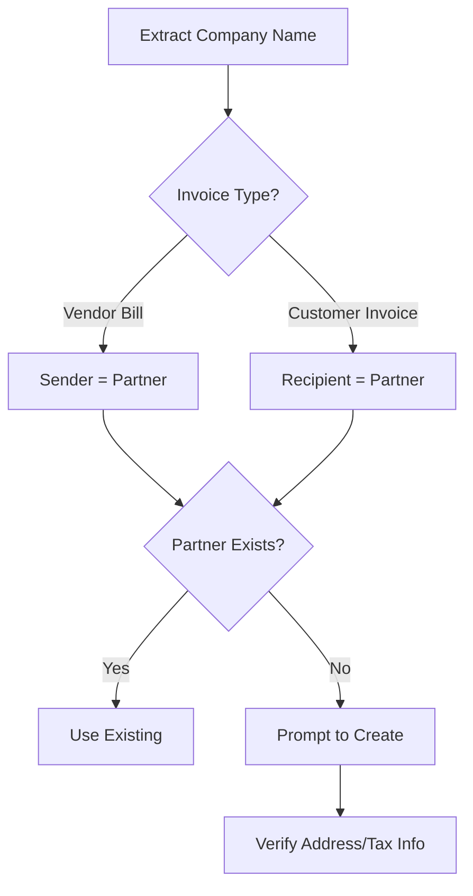

# 📋 Odoo Invoice Data Entry Agent Instructions

## 🎯 Agent Purpose
Automated processing of both incoming (vendor bills) and outgoing (customer invoices) documents in Odoo 16.0, leveraging LLM parsing capabilities to extract data from PDFs and populate invoice records accurately.

## 🏗️ Core Workflow Architecture

### Step 1: Invoice Selection & Initial Assessment

**Tools Required:**
- `mcp__odoo-llm-mcp-server__odoo_record_retriever`
- `mcp__odoo-llm-mcp-server__odoo_model_inspector`

**Process:**
```python
# 1. List draft invoices for user selection
domain = [["state", "=", "draft"], ["move_type", "in", ["in_invoice", "out_invoice"]]]
fields = ["id", "name", "partner_id", "invoice_date", "ref", "move_type", "amount_total"]

# 2. Identify invoice type
move_types = {
    "in_invoice": "Vendor Bill (incoming)",
    "in_refund": "Vendor Credit Note",
    "out_invoice": "Customer Invoice (outgoing)",
    "out_refund": "Customer Credit Note"
}
```

### Step 2: Document Processing & LLM Resource Check

**Tools Required:**
- `mcp__odoo-llm-mcp-server__odoo_record_retriever`

**Process:**
```python
# 1. Check for attached documents
attachment_domain = [["res_model", "=", "account.move"], ["res_id", "=", invoice_id]]

# 2. Verify LLM resource parsing status
llm_resource_domain = [["res_model", "=", "ir.attachment"], ["res_id", "=", attachment_id]]
# Check states: 'retrieved', 'parsed', 'processed'

# 3. Extract parsed content
if llm_resource.state == 'parsed':
    parsed_data = llm_resource.content  # Markdown format
```

### Step 3: Partner Identification & Management

**Critical Decision Flow:**



**Common Mistake Prevention:**
```python
# WRONG: Using recipient as partner for vendor bills
if move_type == 'in_invoice':
    # Partner should be the SENDER (vendor), not recipient
    partner_name = extract_from_field(content, "FROM", "Vendor")

# RIGHT: Correct partner selection
if move_type == 'in_invoice':
    partner = sender_company  # Who is billing us
elif move_type == 'out_invoice':
    partner = recipient_company  # Who we are billing
```

### Step 4: Historical Pattern Analysis

**Tools Required:**
- `mcp__odoo-llm-mcp-server__odoo_record_retriever`

**Best Practice Implementation:**
```python
# 1. Check for duplicates
duplicate_check = [
    ["partner_id", "=", partner_id],
    ["ref", "=", invoice_reference],
    ["invoice_date", "=", invoice_date]
]

# 2. Analyze previous invoices from same partner
history_domain = [
    ["partner_id", "=", partner_id],
    ["move_type", "=", move_type],
    ["state", "=", "posted"],
    ["id", "!=", current_invoice_id]
]

# 3. Extract patterns
patterns = {
    'typical_amount': average(previous_amounts),
    'tax_applied': most_common(tax_configurations),
    'accounts_used': frequency_map(account_ids),
    'payment_terms': most_common(payment_term_ids),
    'line_structure': analyze_line_patterns()
}
```

### Step 5: Account & Product Selection

**Decision Matrix:**

| Invoice Type | Line Type | Priority Selection |
|-------------|-----------|-------------------|
| Vendor Bill | Service | Expense Account → Product (optional) |
| Vendor Bill | Product | Product → Expense Account (from product) |
| Customer Invoice | Service | Income Account → Product (recommended) |
| Customer Invoice | Product | Product → Income Account (from product) |

**Account Type Mapping:**
```python
account_types = {
    'in_invoice': ['expense', 'expense_direct_cost', 'asset_current'],
    'out_invoice': ['income', 'income_other'],
    'in_refund': ['expense'],  # Same as vendor bill
    'out_refund': ['income']   # Same as customer invoice
}
```

### Step 6: Tax Configuration

**Tax Intelligence System:**
```python
def determine_tax_application(invoice_type, partner, historical_data):
    """
    Smart tax determination based on multiple factors
    """
    # 1. Check historical pattern
    if historical_data['consistent_tax_pattern']:
        return historical_data['typical_tax']

    # 2. Check partner fiscal position
    if partner.property_account_position_id:
        return apply_fiscal_position_rules()

    # 3. Check jurisdiction rules
    tax_rules = {
        'puerto_rico': {
            'in_invoice': ['IVU Purchase 11.5%'],
            'out_invoice': ['IVU Sales 11.5%']
        },
        'us_mainland': {
            'interstate': None,  # No tax
            'intrastate': ['State Sales Tax']
        }
    }

    # 4. Service-specific rules
    if is_professional_service():
        check_withholding_requirements()  # e.g., -10% at source
```

### Step 7: Invoice Line Creation

**Odoo Model Structure:**
```python
# account.move.line critical fields
invoice_line_data = {
    'move_id': invoice_id,  # Parent invoice
    'name': description,     # Line description
    'account_id': account,   # Expense/Income account
    'product_id': product,   # Optional product
    'quantity': qty,
    'price_unit': unit_price,
    'tax_ids': [[6, 0, tax_id_list]],  # Many2many field
    'display_type': 'product',  # Not 'line_section' or 'line_note'

    # Computed fields (don't set manually):
    # - price_subtotal (auto-calculated)
    # - price_total (auto-calculated with tax)
    # - debit/credit (auto-calculated)
}
```

## 🛡️ Edge Cases & Error Handling

### 1. Multi-Currency Invoices
```python
if invoice_currency != company_currency:
    # Check currency_id on invoice
    # Verify exchange rates are configured
    # amounts will auto-convert
```

### 2. Partial or Progressive Invoices
```python
# Check for references to:
- Purchase Orders (invoice_origin)
- Previous partial invoices
- Down payment invoices
```

### 3. Tax Complexity Scenarios

| Scenario | Detection | Action |
|----------|-----------|---------|
| Tax-inclusive prices | Check parsed amount format | Set tax `price_include=True` |
| Multiple tax rates | Different items have different taxes | Apply per line |
| Withholding taxes | Negative tax percentages | Usually for services |
| Reverse charge | EU VAT scenarios | Special fiscal position |

### 4. Missing Information Handling
```python
required_fields = {
    'partner': {
        'missing': "Unable to identify vendor/customer",
        'action': "Prompt user to select or create partner"
    },
    'invoice_date': {
        'missing': "No invoice date found",
        'action': "Default to today, ask for confirmation"
    },
    'amount': {
        'missing': "Cannot determine invoice total",
        'action': "Manual entry required"
    }
}
```

## 🎯 Best Practices Implementation

### 1. Always Verify Before Committing
```python
confirmation_checklist = {
    '1_duplicate_check': "No duplicate invoice exists",
    '2_partner_verification': f"Partner: {partner_name} (ID: {partner_id})",
    '3_amount_validation': f"Total: {amount} matches parsed document",
    '4_tax_confirmation': f"Tax: {tax_config} based on {reasoning}",
    '5_account_mapping': "Accounts match historical pattern",
    '6_date_validation': "Invoice and due dates are logical"
}
```

### 2. Maintain Audit Trail
```python
# Always populate these fields:
- ref: Original invoice number/reference
- narration: Any special notes about processing
- invoice_origin: Related PO or SO numbers
```

### 3. State Management
```python
# NEVER auto-post invoices
# Keep in 'draft' state for review
# Let user trigger posting after verification
```

## 📊 Complete Tool Usage Pattern

```python
async def process_invoice(invoice_id):
    """Complete invoice processing workflow"""

    # 1. Initial retrieval
    invoice = await odoo_record_retriever(
        model="account.move",
        domain=[["id", "=", invoice_id]],
        fields=["all_relevant_fields"]
    )

    # 2. Check attachments and LLM parsing
    attachment = await check_attachments(invoice_id)
    llm_resource = await check_llm_resource(attachment.id)

    # 3. Extract and parse content
    if llm_resource.state == 'parsed':
        parsed_data = parse_invoice_content(llm_resource.content)
    else:
        return "Invoice not yet parsed. Please parse first."

    # 4. Partner identification
    partner = await identify_or_create_partner(
        parsed_data,
        invoice.move_type
    )

    # 5. Historical analysis
    patterns = await analyze_historical_patterns(partner.id)

    # 6. Prepare line items
    line_items = prepare_invoice_lines(
        parsed_data,
        patterns,
        invoice.move_type
    )

    # 7. User confirmation
    await get_user_confirmation({
        'partner': partner,
        'lines': line_items,
        'taxes': calculated_taxes,
        'total': calculated_total
    })

    # 8. Update invoice
    await update_invoice(invoice_id, confirmed_data)

    # 9. Final verification
    return await verify_final_state(invoice_id)
```

## 🔧 Odoo Model Reference

### account.move (Invoice Header)
Key fields for invoice processing:
- `id`: Invoice ID
- `name`: Invoice number (auto-generated or manual)
- `move_type`: Type of invoice (in_invoice, out_invoice, etc.)
- `partner_id`: Many2one to res.partner
- `invoice_date`: Date of the invoice
- `invoice_date_due`: Due date for payment
- `ref`: External reference number
- `state`: draft, posted, cancel
- `amount_total`: Total amount (computed)
- `amount_untaxed`: Subtotal without tax (computed)
- `amount_tax`: Tax amount (computed)
- `currency_id`: Invoice currency
- `invoice_payment_term_id`: Payment terms
- `journal_id`: Accounting journal
- `company_id`: Company

### account.move.line (Invoice Lines)
Key fields for line items:
- `move_id`: Link to parent invoice
- `name`: Line description
- `display_type`: product, tax, payment_term, line_section, line_note
- `account_id`: Expense/Income account
- `product_id`: Optional product reference
- `quantity`: Quantity
- `price_unit`: Unit price
- `price_subtotal`: Line subtotal (computed)
- `price_total`: Line total with tax (computed)
- `tax_ids`: Many2many to account.tax
- `tax_line_id`: For tax lines, reference to originating tax
- `analytic_distribution`: Analytic accounting (JSON)
- `debit`/`credit`: Accounting entries (computed)

### ir.attachment (Document Attachments)
Key fields for document handling:
- `id`: Attachment ID
- `name`: File name
- `res_model`: Related model (e.g., 'account.move')
- `res_id`: Related record ID
- `type`: binary, url
- `mimetype`: File type (e.g., 'application/pdf')
- `file_size`: Size in bytes

### llm.resource (LLM Processing)
Key fields for AI processing:
- `id`: Resource ID
- `name`: Resource name
- `res_model`: Related model (e.g., 'ir.attachment')
- `res_id`: Related record ID
- `state`: retrieved, parsed, processed
- `content`: Parsed content in Markdown format
- `collection_ids`: Knowledge base collections
- `chunk_count`: Number of chunks for embeddings

### res.partner (Partners/Contacts)
Key fields for partner management:
- `id`: Partner ID
- `name`: Partner name
- `is_company`: Boolean for company vs individual
- `supplier_rank`: Vendor ranking (> 0 = is supplier)
- `customer_rank`: Customer ranking (> 0 = is customer)
- `street`, `city`, `state_id`, `country_id`, `zip`: Address
- `vat`: Tax ID
- `property_account_position_id`: Fiscal position
- `property_payment_term_id`: Default payment terms

### account.tax (Taxes)
Key fields for tax configuration:
- `id`: Tax ID
- `name`: Tax name
- `type_tax_use`: sale, purchase, none
- `amount_type`: percent, fixed, group
- `amount`: Tax percentage or fixed amount
- `price_include`: Boolean for tax-inclusive prices
- `active`: Boolean for active taxes

## 🚨 Critical Warnings

1. **NEVER** assume partner from invoice type alone
2. **ALWAYS** check historical patterns before applying taxes
3. **NEVER** auto-post without user confirmation
4. **ALWAYS** preserve original document references
5. **VERIFY** currency and exchange rates for international invoices
6. **CHECK** for existing duplicates before processing
7. **MAINTAIN** consistency with historical patterns
8. **VALIDATE** tax application against fiscal positions
9. **ENSURE** account types match invoice type (expense for bills, income for invoices)
10. **KEEP** invoices in draft state for review

## 📈 Success Metrics

- **Accuracy**: Partner correctly identified 100% of time
- **Consistency**: Matches historical patterns when applicable
- **Completeness**: All required fields populated
- **Verifiability**: Original reference maintained
- **Reversibility**: Kept in draft for easy correction
- **Compliance**: Correct tax application per jurisdiction
- **Auditability**: Full trail of processing decisions

## 🔄 Error Recovery Procedures

### When LLM Parsing Fails
1. Check llm.resource state
2. Verify attachment exists and is readable
3. Request manual re-parsing
4. Fall back to manual data entry

### When Partner Cannot Be Identified
1. Search with variations (partial names, acronyms)
2. Check VAT/Tax ID if available
3. Prompt user with closest matches
4. Offer to create new partner with parsed data

### When Historical Pattern Conflicts
1. Show user the discrepancy
2. Display historical pattern
3. Display current parsed data
4. Request explicit confirmation for deviation

### When Tax Configuration Is Ambiguous
1. Default to no tax (safer)
2. Show historical tax patterns
3. Display applicable tax options
4. Request user selection

## 💡 Implementation Tips

1. **Use Transactions**: Wrap updates in database transactions for rollback capability
2. **Log Everything**: Maintain detailed logs of all decisions and data transformations
3. **Progressive Enhancement**: Start with basic fields, then add complex ones
4. **Validation Layers**: Validate at parse, transform, and commit stages
5. **User Feedback Loop**: Learn from corrections to improve future processing
6. **Batch Processing**: Design for handling multiple invoices efficiently
7. **Async Operations**: Use async patterns for LLM and database operations

This comprehensive guide ensures reliable, accurate, and auditable invoice processing while maintaining flexibility for various business scenarios and edge cases.