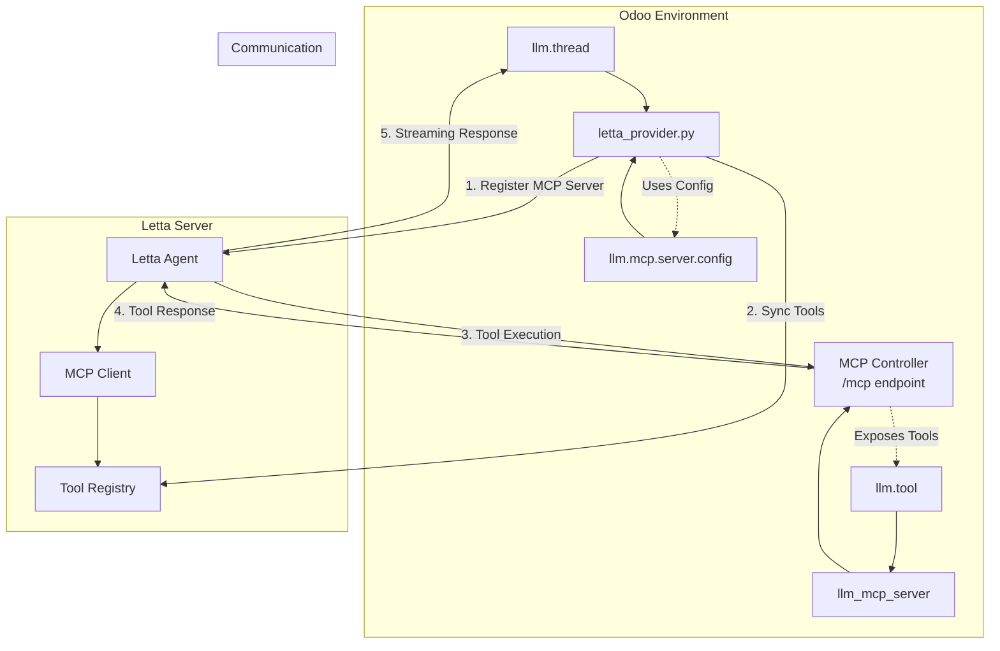

# LLM Letta Integration Technical Guide

## Overview

The `llm_letta` module integrates Letta AI agents with Odoo's LLM framework. Letta provides agent-centric architecture with persistent memory and built-in MCP (Model Context Protocol) support for tool integration.

**⚠️ Important: This integration requires Letta server version 0.11.7. Earlier versions contain bugs that prevent proper MCP integration.**

## Architecture Components

### Core Components

1. **Letta Provider** (`letta_provider.py`)

   - Implements LLM provider interface for Letta agents
   - Handles agent creation, management, and message generation
   - Manages MCP server registration and tool synchronization

2. **Thread Integration** (`llm_thread.py`)

   - Extends `llm.thread` with Letta-specific functionality
   - Handles tool synchronization when thread tools change
   - Provides UI elements for Letta tool management

3. **MCP Server Configuration**
   - Uses `llm.mcp.server.config` model for configuration
   - Supports configurable external URLs for Docker environments

## Integration Flow



## Key Workflows

### 1. MCP Server Registration

```python
def letta_ensure_mcp_server(self):
    # Get server URL from configuration
    server_url = mcp_config.get_mcp_server_url()

    # Register with Letta using StreamableHttpServerConfig
    mcp_config = StreamableHttpServerConfig(
        server_name=server_name,
        server_url=server_url,
        type="streamable_http"
    )
    client.tools.add_mcp_server(request=mcp_config)
```

### 2. Tool Synchronization

When `llm.thread.tool_ids` changes:

1. **Hook triggered** in `llm_thread.py`
2. **Provider method called** via `letta_sync_agent_tools()`
3. **Current tools fetched** from Letta agent
4. **Tools filtered** by `tool_type == "external_mcp"`
5. **Sync performed**: attach missing tools, detach removed tools

### 3. Message Streaming

```python
def _letta_get_agent_stream(self, client, agent_id, user_content):
    stream = client.agents.messages.create_stream(
        agent_id=agent_id,
        messages=[MessageCreate(role="user", content=user_content)],
        stream_tokens=True
    )

    for chunk in stream:
        if chunk.message_type == "assistant_message":
            yield {"content": chunk.content}
        elif chunk.message_type == "tool_call_message":
            _logger.info("Agent calling tool: %s", chunk.tool_call.name)
        elif chunk.message_type == "tool_return_message":
            _logger.info("Tool returned: %s", chunk.tool_return)
```

## MCP Server Integration

### Available Tools

The Odoo MCP server exposes these tools to Letta agents:

- `odoo_record_retriever` - Search and retrieve Odoo records
- `odoo_record_creator` - Create new Odoo records
- `odoo_record_updater` - Update existing Odoo records
- `odoo_record_unlinker` - Delete Odoo records
- `odoo_model_method_executor` - Execute Odoo model methods
- `odoo_model_inspector` - Inspect Odoo model structure

### Tool Execution Flow

1. **Letta agent** decides to call a tool
2. **MCP Client** in Letta sends request to `/mcp` endpoint
3. **MCP Controller** processes the request
4. **Tool implementation** executes in `llm_tool` module
5. **Result returned** via MCP protocol
6. **Agent continues** with tool result

## Prerequisites

### Letta Server Requirements

- **Letta server version 0.11.7** (required)
- Server running on accessible URL (e.g., `http://localhost:8283`)
- API key (not required for local development)

### Installation

```bash
# Install specific Letta version
pip install letta==0.11.7

# Start Letta server
letta server
```

## Configuration

### Basic Setup

```python
# Create Letta provider (local development)
provider = env['llm.provider'].create({
    'name': 'Letta Local',
    'service': 'letta',
    'base_url': 'http://localhost:8283',
    # api_key not required for local development
})

# For production/remote Letta server
provider = env['llm.provider'].create({
    'name': 'Letta Remote',
    'service': 'letta',
    'base_url': 'https://your-letta-server.com',
    'api_key': 'your-api-key'
})
```

### MCP Server Configuration

```python
# Configure external URL for Docker environments
mcp_config = env['llm.mcp.server.config'].get_active_config()
mcp_config.external_url = 'http://host.docker.internal:8069'
```

### Thread with Tools

```python
# Create thread with Letta agent
thread = env['llm.thread'].create({
    'provider_id': provider.id,
    'external_id': 'agent-123',  # Letta agent ID
    'tool_ids': [(6, 0, tool_ids)]  # Auto-synced to agent
})
```

## Message Types

### Letta Streaming Messages

- `assistant_message` - AI response content (streamed to user)
- `reasoning_message` - Internal agent reasoning (logged)
- `tool_call_message` - Tool execution requests (logged)
- `tool_return_message` - Tool execution results (logged)
- `usage_statistics` - Token usage information (logged)

### Error Handling

- **Connection errors**: MCP server not reachable
- **Tool errors**: Tool execution failures
- **Agent errors**: Letta agent issues
- **Sync errors**: Tool synchronization failures

## Development Notes

### Docker Environment

When Letta runs in Docker:

- Set `external_url` in MCP config to `http://host.docker.internal:8069`
- Ensure Odoo is accessible from Docker container
- Use proper networking configuration

### Tool Development

New tools automatically available to Letta agents when:

1. Added to `llm.tool` in Odoo
2. MCP server restart (automatic)
3. Tool sync triggered on thread

### Debugging

Enable INFO logging to see:

- Tool call details
- Agent reasoning
- Tool execution results
- MCP communication logs
