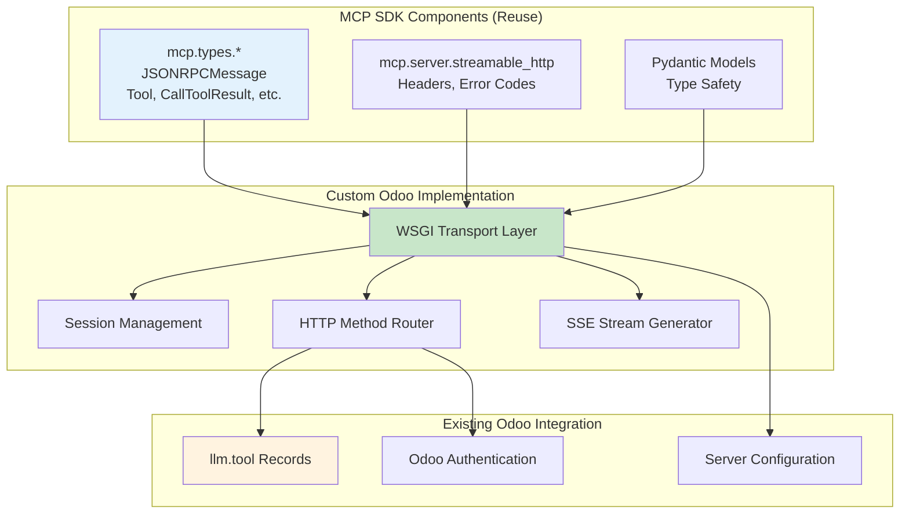

# Final Approach: MCP-Compliant Odoo Integration

## Executive Summary

Transform the existing `llm_mcp_server` module into a fully MCP-compliant implementation by leveraging the MCP Python SDK's type system while implementing a custom WSGI transport layer.

## Current State Analysis

### ✅ What's Already Good
- JSON-RPC 2.0 protocol implementation
- Tool discovery via `llm.tool` records
- User authentication and access control
- Basic request/response handling

### ❌ Missing MCP Compliance
- Session management (`mcp-session-id` headers)
- Stateful/Stateless mode support
- GET endpoint for SSE streams
- DELETE endpoint for session termination
- Response format negotiation (JSON vs SSE)
- Protocol version negotiation

## Final Architecture Approach

### Strategy: Hybrid Implementation
**Use MCP SDK for types and validation, implement custom WSGI transport**



## Implementation Plan

### Phase 1: MCP SDK Integration
**Replace manual implementations with MCP SDK components**

#### 1.1 Update Dependencies
```python
# __manifest__.py
'external_dependencies': {
    'python': ['mcp']
}
```

#### 1.2 Replace Manual Types
```python
# controllers/mcp_controller.py
# BEFORE (manual):
params = json.loads(raw_body)
method = params.get("method")

# AFTER (MCP SDK):
from mcp.types import JSONRPCMessage, JSONRPCRequest, CallToolRequest
message = JSONRPCMessage.model_validate_json(raw_body)
if isinstance(message.root, JSONRPCRequest):
    method = message.root.method
```

#### 1.3 Use MCP Constants
```python
from mcp.server.streamable_http import (
    MCP_SESSION_ID_HEADER,
    MCP_PROTOCOL_VERSION_HEADER,
    CONTENT_TYPE_JSON,
    CONTENT_TYPE_SSE
)
from mcp.types import PARSE_ERROR, INVALID_REQUEST, METHOD_NOT_FOUND
```

### Phase 2: Session Management
**Implement proper MCP session handling**

#### 2.1 Add Mode Configuration
```python
# models/llm_mcp_server_config.py
class LLMMCPServerConfig(models.Model):
    # Existing fields...
    
    stateless_mode = fields.Boolean(
        default=False,
        help="Stateless mode: no sessions, serverless-friendly"
    )
    json_response_mode = fields.Boolean(
        default=False, 
        help="JSON response mode: return JSON directly instead of SSE streams"
    )
    enable_resumability = fields.Boolean(
        default=False,
        help="Enable event storage for resumability support"
    )
```

#### 2.2 Authentication Strategy
**Use Odoo's built-in API key system for MCP authentication**

```python
# API Key Creation (via Odoo shell or admin interface)
def create_mcp_api_key(user_login: str, name: str = "MCP Integration Key"):
    """Create persistent API key for MCP client authentication"""
    user = env['res.users'].search([('login', '=', user_login)], limit=1)
    if not user:
        raise ValueError(f"User {user_login} not found")
    
    key = env['res.users.apikeys'].sudo().with_user(user)._generate(
        scope=None,              # Global key for RPC/HTTP usage
        name=name,               # Description
        expiration_date=None     # Persistent key (no expiration)
    )
    return key

# Core Helper Functions (used throughout the controller)
def _extract_api_key(self):
    """Extract API key from Authorization Bearer or X-API-KEY header"""
    import re
    # Check Authorization: Bearer <key>
    header = request.httprequest.headers.get('Authorization')
    if header:
        m = re.match(r"^Bearer\s+(.+)$", header, re.IGNORECASE)
        if m:
            return m.group(1)
    
    # Fallback to X-API-KEY header
    return request.httprequest.headers.get('X-API-KEY')

def _authenticate_api_key_or_error(self):
    """Validate API key and bind request to corresponding user"""
    token = self._extract_api_key()
    if not token:
        return self._http_error_response(
            None, JSONRPCErrorCodes.AUTHENTICATION_REQUIRED,
            "Missing API key in Authorization or X-API-KEY header"
        )
    
    # Validate API key using Odoo's built-in system
    uid = request.env['res.users.apikeys']._check_credentials(scope='rpc', key=token)
    if not uid:
        return self._http_error_response(
            None, JSONRPCErrorCodes.AUTHENTICATION_REQUIRED,
            "Invalid API key"
        )
    
    # Check for session conflict
    if request.env.uid and request.env.uid != uid:
        return self._http_error_response(
            None, JSONRPCErrorCodes.ACCESS_DENIED,
            "Session user does not match API key user"
        )
    
    # Bind request environment to API key owner
    request.update_env(user=uid)
    return None  # Success
```

#### 2.3 Session Storage with Odoo Integration
```python
# models/mcp_session.py
class MCPSession(models.Model):
    _name = 'mcp.session'
    _description = 'MCP Session Storage'
    
    # Use Odoo session ID as MCP session ID for stateful mode
    session_id = fields.Char(required=True, index=True, help="Odoo session ID used as MCP session ID")
    user_id = fields.Many2one('res.users', required=True)
    api_key_id = fields.Many2one('res.users.apikeys', help="API key used for authentication")
    created_at = fields.Datetime(default=fields.Datetime.now)
    last_accessed = fields.Datetime(default=fields.Datetime.now)
    active = fields.Boolean(default=True)
    has_sse_stream = fields.Boolean(default=False, help="Track active SSE connection")
    client_info = fields.Json(help="MCP client information from initialize request")
    metadata = fields.Json()
    
    def create_from_odoo_session(self, api_key_record):
        """Create MCP session using current Odoo session ID"""
        odoo_session_id = request.session.sid
        return self.create({
            'session_id': odoo_session_id,  # Use Odoo session ID as MCP session ID
            'user_id': api_key_record.user_id.id,
            'api_key_id': api_key_record.id,
            'active': True
        })
    
    def touch_last_accessed(self):
        """Update last accessed timestamp"""
        self.last_accessed = fields.Datetime.now()

# models/mcp_event.py (for resumability)
class MCPEvent(models.Model):
    _name = 'mcp.event'
    _description = 'MCP Event Storage for Resumability'
    _order = 'sequence'
    
    event_id = fields.Char(required=True, index=True)
    stream_id = fields.Char(required=True, index=True)
    sequence = fields.Integer(required=True, index=True)
    message_data = fields.Json(required=True)
    created_at = fields.Datetime(default=fields.Datetime.now, index=True)
    session_id = fields.Many2one('mcp.session', ondelete='cascade')
```

### Phase 3: HTTP Transport Layer
**Implement full streamable_http transport**

#### 3.1 Method Router with API Key Authentication
```python
# controllers/mcp_controller.py
@http.route('/mcp', type='http', auth='public', methods=['GET', 'POST', 'DELETE'], csrf=False)
def mcp_endpoint(self):
    """MCP streamable_http transport endpoint with conditional API key authentication"""
    # Parse request to determine if API key is required
    auth_required = self._is_authentication_required()
    
    if auth_required:
        # Authenticate using API key for tool execution
        auth_error = self._authenticate_api_key_or_error()
        if auth_error:
            return auth_error
    
    # Get configuration
    config = self._get_config()
    
    if config.stateless_mode:
        return self._handle_stateless()
    else:
        return self._handle_stateful()

def _is_authentication_required(self):
    """Determine if API key authentication is required for this request"""
    if request.httprequest.method != 'POST':
        return True  # GET/DELETE always need authentication
    
    # For POST, check the method
    try:
        raw_body = request.httprequest.get_data(as_text=True)
        if not raw_body.strip():
            return False
        
        data = json.loads(raw_body)
        method = data.get('method', '')
        
        # These methods don't require authentication
        anonymous_methods = ['initialize', 'tools/list']
        return method not in anonymous_methods
        
    except (json.JSONDecodeError, AttributeError):
        return True  # If we can't parse, assume auth required

def _handle_stateless(self):
    """Stateless mode: no sessions, API key auth only"""
    if request.httprequest.method == 'POST':
        return self._handle_post_stateless()
    elif request.httprequest.method == 'GET':
        return self._error(405, "SSE not supported in stateless mode")
    else:
        return self._error(405, "Method not allowed")

def _handle_stateful(self):
    """Stateful mode: full session support with Odoo session integration"""
    if request.httprequest.method == 'POST':
        return self._handle_post_stateful()
    elif request.httprequest.method == 'GET':
        return self._handle_sse_stream()
    elif request.httprequest.method == 'DELETE':
        return self._handle_session_delete()

def _get_or_create_mcp_session(self):
    """Get existing MCP session or create new one using Odoo session ID"""
    # Get current Odoo session ID
    odoo_session_id = request.session.sid
    
    # Determine user context
    if request.env.uid and not request.env.user._is_public():
        # Authenticated user
        user_id = request.env.uid
        search_domain = [
            ('session_id', '=', odoo_session_id),
            ('user_id', '=', user_id),
            ('active', '=', True)
        ]
    else:
        # Anonymous user
        user_id = request.env.ref('base.public_user').id
        search_domain = [
            ('session_id', '=', odoo_session_id),
            ('user_id', '=', user_id),
            ('active', '=', True)
        ]
    
    # Look for existing MCP session
    mcp_session = request.env['mcp.session'].sudo().search(search_domain, limit=1)
    
    if not mcp_session:
        # Find API key record if available
        api_key_record = None
        if user_id != request.env.ref('base.public_user').id:
            api_key_token = self._extract_api_key()
            if api_key_token:
                api_key_record = request.env['res.users.apikeys'].sudo().search([
                    ('user_id', '=', user_id),
                    ('key', '=', api_key_token)
                ], limit=1)
        
        # Create new MCP session
        mcp_session = request.env['mcp.session'].sudo().create({
            'session_id': odoo_session_id,
            'user_id': user_id,
            'api_key_id': api_key_record.id if api_key_record else None,
            'active': True
        })
    
    # Update last accessed
    mcp_session.sudo().touch_last_accessed()
    return mcp_session
```

#### 3.2 Protocol Validation (Critical Requirements)
```python
def _validate_accept_headers(self, method: str):
    """Validate Accept headers per MCP spec"""
    accept_header = request.httprequest.headers.get('accept', '')
    
    if method == 'POST':
        # POST MUST accept BOTH application/json AND text/event-stream
        has_json = 'application/json' in accept_header
        has_sse = 'text/event-stream' in accept_header
        if not (has_json and has_sse):
            return self._http_error_response(
                None, JSONRPCErrorCodes.INVALID_REQUEST,
                "POST requests must accept both application/json and text/event-stream"
            )
    elif method == 'GET':
        # GET MUST accept text/event-stream
        if 'text/event-stream' not in accept_header:
            return self._http_error_response(
                None, JSONRPCErrorCodes.INVALID_REQUEST,
                "GET requests must accept text/event-stream"
            )
    return None

def _validate_content_type(self):
    """Validate Content-Type for POST requests"""
    content_type = request.httprequest.headers.get('content-type', '')
    if not content_type.startswith('application/json'):
        return self._http_error_response(
            None, JSONRPCErrorCodes.INVALID_REQUEST,
            "Content-Type must be application/json"
        )
    return None

def _validate_protocol_version(self):
    """Validate MCP protocol version"""
    from mcp.shared.version import SUPPORTED_PROTOCOL_VERSIONS
    from mcp.types import DEFAULT_NEGOTIATED_VERSION
    
    client_version = request.httprequest.headers.get(MCP_PROTOCOL_VERSION_HEADER)
    if not client_version:
        client_version = DEFAULT_NEGOTIATED_VERSION
    
    if client_version not in SUPPORTED_PROTOCOL_VERSIONS:
        supported = ", ".join(SUPPORTED_PROTOCOL_VERSIONS)
        return self._http_error_response(
            None, JSONRPCErrorCodes.INVALID_REQUEST, 
            f"Unsupported protocol version: {client_version}. Supported: {supported}"
        )
    return None

def _validate_session_id_format(self, session_id: str) -> bool:
    """Validate session ID format (ASCII 0x21-0x7E)"""
    import re
    if not session_id:
        return False
    SESSION_ID_PATTERN = re.compile(r"^[\x21-\x7E]+$")
    return SESSION_ID_PATTERN.fullmatch(session_id) is not None
```

#### 3.3 SSE Implementation with Resumability
```python
def _handle_sse_stream(self):
    """Server-Sent Events stream with conflict detection and resumability"""
    # Validate Accept header
    accept_error = self._validate_accept_headers('GET')
    if accept_error:
        return accept_error
        
    # Validate protocol version
    version_error = self._validate_protocol_version()
    if version_error:
        return version_error
    
    # Get or create MCP session (uses Odoo session ID)
    mcp_session = self._get_or_create_mcp_session()
    session_id = mcp_session.session_id  # This is the Odoo session ID
    
    # Validate session ID format (Odoo session IDs are always valid)
    if not self._validate_session_id_format(session_id):
        return self._http_error_response(None, 400, "Invalid session ID format")
    
    # Check for SSE conflict (only one GET stream per session)
    if mcp_session.has_sse_stream:
        return self._http_error_response(None, 409, "Only one SSE stream allowed per session")
    
    # Handle resumability
    last_event_id = request.httprequest.headers.get('last-event-id')
    if last_event_id:
        return self._replay_events(mcp_session, last_event_id)
    
    # Mark session as having SSE stream
    mcp_session.has_sse_stream = True
    
    def generate():
        try:
            # Connection established event
            yield "event: connected\ndata: {}\n\n"
            
            while True:
                try:
                    # Poll for server messages
                    messages = self._get_server_messages(session_id)
                    for msg in messages:
                        # Store event for resumability if enabled
                        event_id = self._store_event(session_id, msg) if self._is_resumability_enabled() else None
                        
                        data = msg.model_dump_json(by_alias=True, exclude_none=True)
                        event_line = f"event: message\ndata: {data}"
                        if event_id:
                            event_line += f"\nid: {event_id}"
                        yield f"{event_line}\n\n"
                    
                    # Keep-alive
                    yield ": keepalive\n\n"
                    time.sleep(1)
                    
                except Exception as e:
                    # Send error event
                    error_data = json.dumps({"error": str(e)})
                    yield f"event: error\ndata: {error_data}\n\n"
                    break
        finally:
            # Clean up: mark session as no longer having SSE stream
            if session:
                session.has_sse_stream = False
    
    return Response(
        generate(),
        content_type=CONTENT_TYPE_SSE,
        headers={
            'Cache-Control': 'no-cache, no-transform',
            'Connection': 'keep-alive',
            MCP_SESSION_ID_HEADER: session_id
        }
    )

def _replay_events(self, session_id: str, last_event_id: str):
    """Replay events after specified event ID"""
    events = request.env['mcp.event'].search([
        ('stream_id', '=', session_id),
        ('sequence', '>', self._get_event_sequence(last_event_id))
    ], order='sequence')
    
    def generate():
        yield "event: connected\ndata: {}\n\n"
        
        for event in events:
            data = json.dumps(event.message_data)
            yield f"event: message\ndata: {data}\nid: {event.event_id}\n\n"
        
        # Continue with live messages
        yield from self._generate_live_messages(session_id)
    
    return Response(generate(), content_type=CONTENT_TYPE_SSE)

def _store_event(self, stream_id: str, message: JSONRPCMessage) -> str:
    """Store event for resumability"""
    if not self._is_resumability_enabled():
        return None
        
    sequence = request.env['mcp.event'].search_count([('stream_id', '=', stream_id)]) + 1
    event_id = f"{stream_id}_{sequence}_{int(time.time() * 1000)}"
    
    request.env['mcp.event'].create({
        'event_id': event_id,
        'stream_id': stream_id,
        'sequence': sequence,
        'message_data': message.model_dump(by_alias=True, exclude_none=True)
    })
    
    return event_id
```

#### 3.4 POST Request Processing with Response Mode Selection
```python
def _handle_post_request(self):
    """Handle POST requests with full validation"""
    # Validate Accept headers (BOTH JSON and SSE required)
    accept_error = self._validate_accept_headers('POST')
    if accept_error:
        return accept_error
    
    # Validate Content-Type
    content_type_error = self._validate_content_type()
    if content_type_error:
        return content_type_error
    
    # Validate protocol version
    version_error = self._validate_protocol_version()
    if version_error:
        return version_error
    
    # Parse JSON-RPC message
    try:
        raw_body = request.httprequest.get_data(as_text=True)
        message = JSONRPCMessage.model_validate_json(raw_body)
    except json.JSONDecodeError as e:
        return self._http_error_response(None, PARSE_ERROR, f"Parse error: {str(e)}")
    except ValidationError as e:
        return self._http_error_response(None, INVALID_PARAMS, f"Validation error: {str(e)}")
    
    # Check response mode configuration
    config = self._get_server_config()
    if config.json_response_mode:
        return self._process_json_response(message)
    else:
        return self._process_sse_response(message)

def _process_json_response(self, message: JSONRPCMessage):
    """Process message and return JSON response directly"""
    request_obj = message.root
    
    if isinstance(request_obj, JSONRPCRequest):
        if request_obj.method == "initialize":
            params = InitializeRequest.model_validate(request_obj.params)
            result = self._handle_initialize(message.id, params)
            return self._json_rpc_http_response(message.id, result=result)
            
        elif request_obj.method == "tools/list":
            # Anonymous access allowed for tool discovery
            params = ListToolsRequest.model_validate(request_obj.params)
            result = self._handle_tools_list(message.id, params)
            return self._json_rpc_http_response(message.id, result=result)
            
        elif request_obj.method == "tools/call":
            # Requires authentication - should have been validated earlier
            if request.env.user._is_public():
                return self._http_error_response(
                    message.id, JSONRPCErrorCodes.AUTHENTICATION_REQUIRED,
                    "Tool execution requires API key authentication"
                )
            params = CallToolRequest.model_validate(request_obj.params)
            result = self._handle_tools_call(message.id, params)
            return self._json_rpc_http_response(message.id, result=result)

def _handle_initialize(self, request_id, params: InitializeRequest):
    """Handle MCP initialize request"""
    # Get or create MCP session
    mcp_session = self._get_or_create_mcp_session()
    
    # Store client information
    if params.clientInfo:
        mcp_session.sudo().write({
            'client_info': {
                'name': params.clientInfo.name,
                'version': params.clientInfo.version
            }
        })
    
    # Get server configuration
    config = self._get_server_config()
    
    result = {
        "protocolVersion": config.protocol_version,
        "capabilities": {
            "tools": {},
            "logging": {},
        },
        "serverInfo": {
            "name": config.name,
            "version": config.version
        },
        # Return Odoo session ID as MCP session ID
        "sessionId": mcp_session.session_id
    }
    
    return result

def _process_sse_response(self, message: JSONRPCMessage):
    """Process message and return SSE stream response"""
    # Create SSE stream for this specific request
    def generate():
        try:
            # Process the request
            result = self._process_jsonrpc_message(message)
            
            # Format as SSE event
            data = result.model_dump_json(by_alias=True, exclude_none=True)
            event_id = self._store_event(f"req_{message.id}", result) if self._is_resumability_enabled() else None
            
            event_line = f"event: message\ndata: {data}"
            if event_id:
                event_line += f"\nid: {event_id}"
            yield f"{event_line}\n\n"
            
        except Exception as e:
            error_data = json.dumps({"error": str(e)})
            yield f"event: error\ndata: {error_data}\n\n"
    
    return Response(
        generate(),
        content_type=CONTENT_TYPE_SSE,
        headers={
            'Cache-Control': 'no-cache, no-transform',
            'Connection': 'keep-alive'
        }
    )
```

### Phase 4: Tool Integration
**Enhance existing tool handling with MCP compliance**

```python
def _handle_tools_list(self, request_id, params):
    """Handle tools/list request with MCP validation"""
    odoo_tools = request.env['llm.tool'].sudo().search([('active', '=', True)])
    mcp_tools = []
    
    for tool in odoo_tools:
        tool_def = tool.get_tool_definition()
        
        # Validate with MCP types for compliance
        try:
            mcp_tool = Tool.model_validate(tool_def)
            mcp_tools.append(mcp_tool.model_dump(by_alias=True, exclude_none=True))
        except ValidationError as e:
            _logger.warning(f"Invalid tool definition for {tool.name}: {e}")
    
    return {"tools": mcp_tools}

def _handle_tools_call(self, request_id, params):
    """Handle tools/call request with proper result formatting"""
    tool_name = params.name
    arguments = params.arguments
    
    # Find and execute tool (existing logic)
    tool = request.env['llm.tool'].search([
        ('name', '=', tool_name), ('active', '=', True)
    ], limit=1)
    
    if not tool:
        raise ValueError(f"Tool not found: {tool_name}")
    
    try:
        result = tool.execute(arguments)
        content = [TextContent(type="text", text=str(result))]
        return CallToolResult(content=content, isError=False)
    except Exception as e:
        error_content = [TextContent(type="text", text=f"Error: {str(e)}")]
        return CallToolResult(content=error_content, isError=True)
```

## Benefits of This Approach

### ✅ MCP SDK Advantages
- **Type Safety**: Pydantic validation for all protocol messages
- **Future-Proof**: Automatic updates with MCP spec changes  
- **Standards Compliance**: Guaranteed protocol adherence
- **Error Handling**: Standard error codes and formats

### ✅ Custom Transport Benefits
- **Odoo Native**: Works with WSGI, sessions, authentication
- **Performance**: Direct database access, no HTTP overhead
- **Integration**: Seamless with existing `llm.tool` system
- **Flexibility**: Support for both stateful/stateless modes

### ✅ Migration Path
- **Incremental**: Can upgrade existing code step by step
- **Backward Compatible**: Existing functionality preserved
- **Low Risk**: MCP types provide validation safety net

## Implementation Roadmap

### Week 1: SDK Integration & Core Setup
- [x] Add MCP dependency to `__manifest__.py`
- [x] Replace manual JSON parsing with `JSONRPCMessage`
- [x] Use MCP constants and error codes
- [ ] Create API key generation utilities

### Week 2: Authentication & Session Management  
- [ ] Add mode configuration to `llm_mcp_server_config`
- [ ] Implement session storage models (`mcp.session`, `mcp.event`)
- [ ] Add conditional API key authentication
- [ ] Implement Odoo session ID integration

### Week 3: Transport Layer & Protocol Compliance
- [ ] Implement full HTTP method routing (GET, POST, DELETE)
- [ ] Add critical protocol validation (Accept headers, Content-Type)
- [ ] Implement SSE streaming with resumability
- [ ] Add stateful/stateless mode support

### Week 4: Testing & Production Ready
- [ ] Test with real MCP clients (Claude Desktop, Letta)
- [ ] Validate tool definitions with `Tool` type
- [ ] Performance optimization and security review
- [ ] Documentation and deployment guides

## File Changes Summary

### New Files
- `models/mcp_session.py` - Session storage with SSE tracking
- `models/mcp_event.py` - Event storage for resumability
- `security/ir.model.access.csv` - Updated with new model permissions

### Modified Files  
- `controllers/mcp_controller.py` - Complete rewrite with MCP types
- `models/llm_mcp_server_config.py` - Add mode configuration
- `__manifest__.py` - Add MCP dependency

### Migration Notes
- Existing tool definitions continue to work
- Configuration is backward compatible
- Gradual rollout possible via feature flags

## Success Criteria

**Protocol Compliance:**
- [ ] Pass MCP protocol test suite
- [ ] Work with real MCP clients (Claude Desktop, Letta)
- [ ] Support both stateful/stateless modes
- [ ] Handle all required HTTP methods with proper validation
- [ ] Complete SSE event handling with resumability

**Integration Quality:**
- [ ] Seamless API key authentication with Odoo users
- [ ] Odoo session ID integration for stateful mode
- [ ] Preserve existing tool functionality and access controls
- [ ] No performance regression from current implementation

**Code Quality:**
- [ ] Type-safe with MCP SDK types and validation
- [ ] Comprehensive error handling with proper HTTP status codes
- [ ] Clean separation between authentication, session, and transport layers
- [ ] Maintainable architecture with clear documentation

## Client Usage Examples

### **1. Creating API Key (Admin/Shell)**
```python
# In Odoo shell or admin interface
def create_mcp_api_key(user_login: str):
    user = env['res.users'].search([('login', '=', user_login)], limit=1)
    key = env['res.users.apikeys'].sudo().with_user(user)._generate(
        scope=None,
        name='MCP Integration Key',
        expiration_date=None  # Persistent
    )
    print(f"API Key for {user_login}: {key}")
    return key
```

### **2. Client Connection Flow**
```bash
# Step 1: Initialize (Anonymous - no API key needed)
curl -X POST http://localhost:8069/mcp \
  -H "Content-Type: application/json" \
  -H "Accept: application/json, text/event-stream" \
  -d '{
    "jsonrpc": "2.0",
    "method": "initialize",
    "id": 1,
    "params": {
      "protocolVersion": "2024-11-05",
      "clientInfo": {"name": "My MCP Client", "version": "1.0.0"}
    }
  }'

# Response includes sessionId (Odoo session ID)
# {
#   "jsonrpc": "2.0",
#   "id": 1,
#   "result": {
#     "protocolVersion": "2024-11-05",
#     "sessionId": "abc123def456...",  // Odoo session ID
#     "serverInfo": {...}
#   }
# }

# Step 2: List Tools (Anonymous - no API key needed)
curl -X POST http://localhost:8069/mcp \
  -H "Content-Type: application/json" \
  -H "Accept: application/json, text/event-stream" \
  -H "mcp-session-id: abc123def456..." \
  -d '{
    "jsonrpc": "2.0",
    "method": "tools/list",
    "id": 2
  }'

# Step 3: Execute Tool (API key required)
curl -X POST http://localhost:8069/mcp \
  -H "Content-Type: application/json" \
  -H "Accept: application/json, text/event-stream" \
  -H "Authorization: Bearer <API_KEY>" \
  -H "mcp-session-id: abc123def456..." \
  -d '{
    "jsonrpc": "2.0",
    "method": "tools/call",
    "id": 3,
    "params": {
      "name": "search_customers",
      "arguments": {"query": "Acme Corp"}
    }
  }'
```

### **3. Session Management Benefits**
- **Odoo Session ID as MCP Session ID**: Leverages existing Odoo session infrastructure
- **Anonymous Discovery**: Clients can discover tools without authentication
- **Authenticated Execution**: Tool execution requires valid API key
- **Cross-Request Persistence**: Sessions persist across multiple requests
- **SSE Support**: Real-time streaming with session continuity

This approach gives you **full MCP compliance** while **maximizing SDK reuse** and **preserving Odoo integration**.