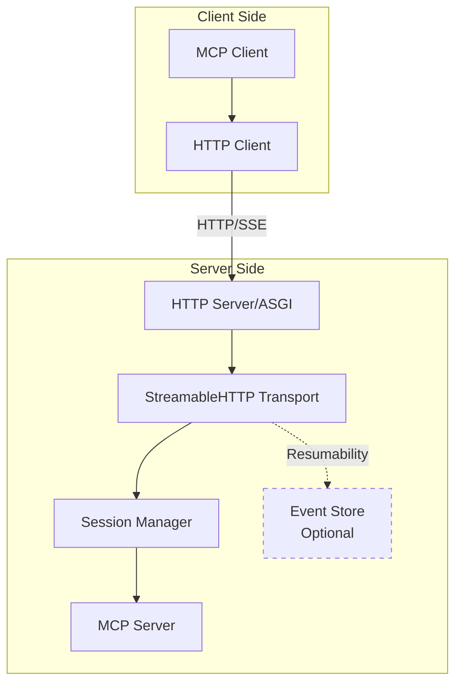
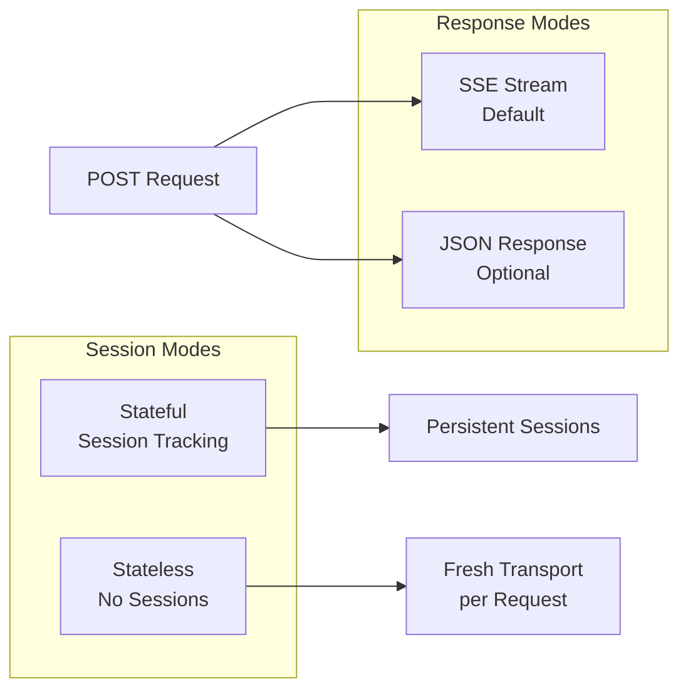
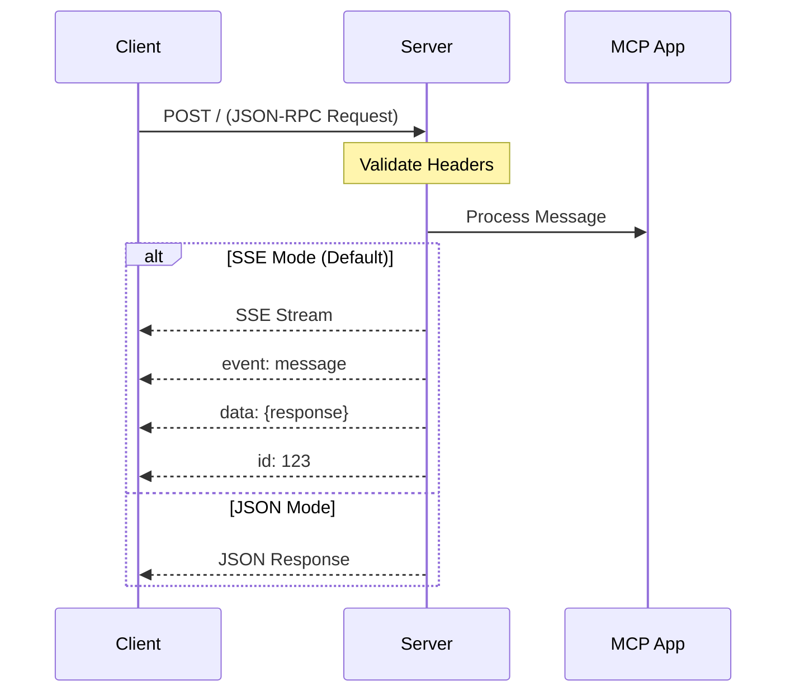
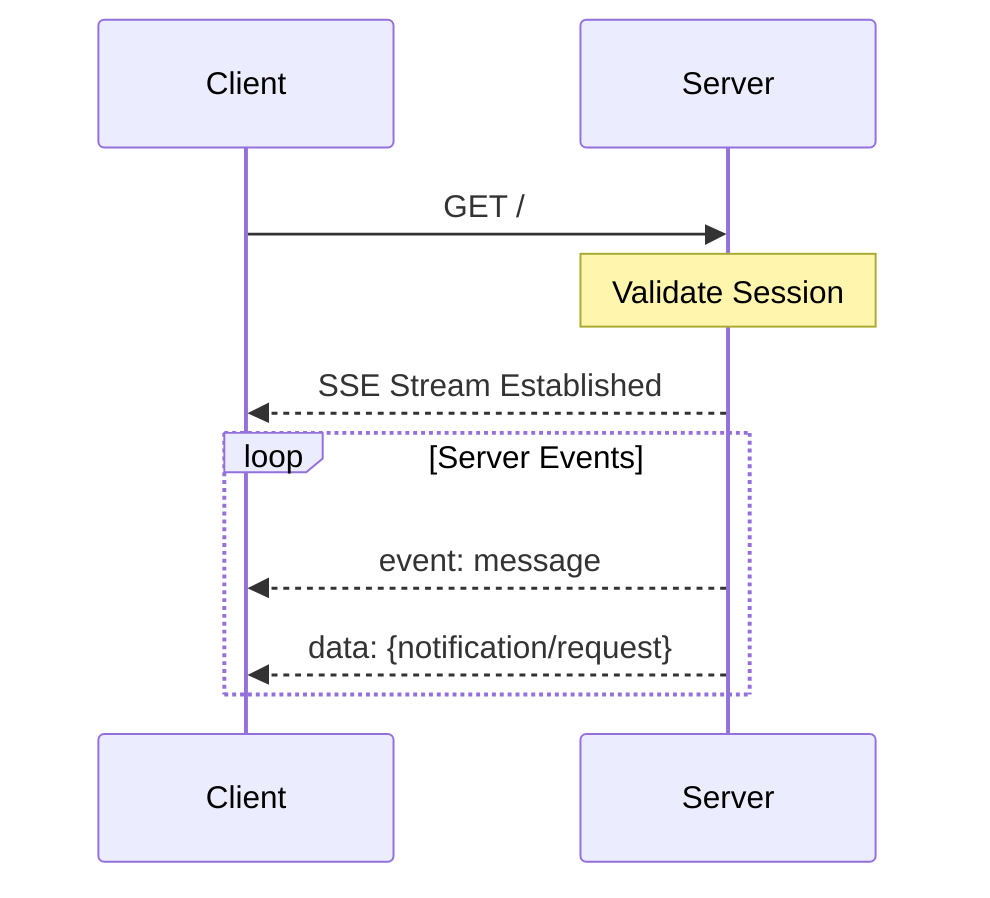
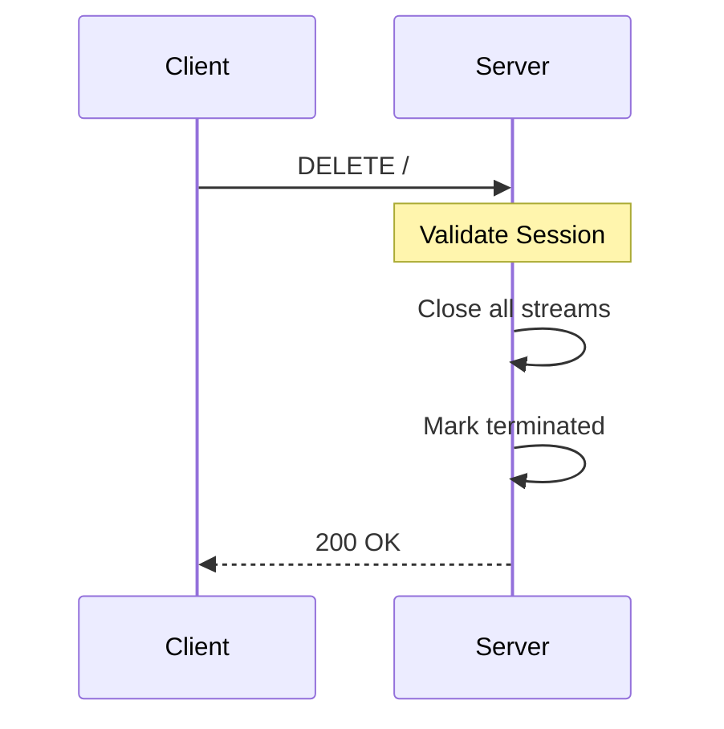
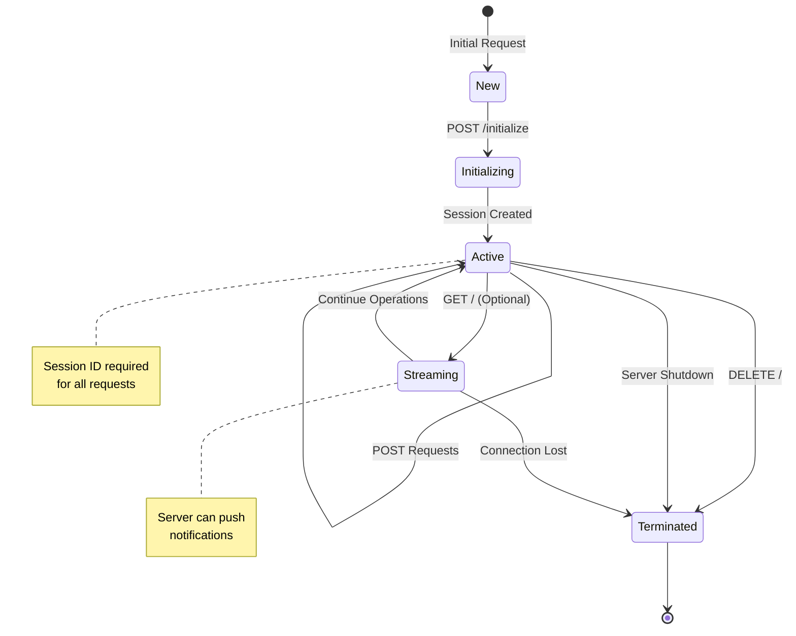
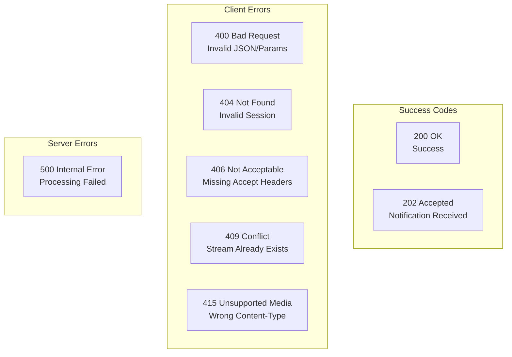
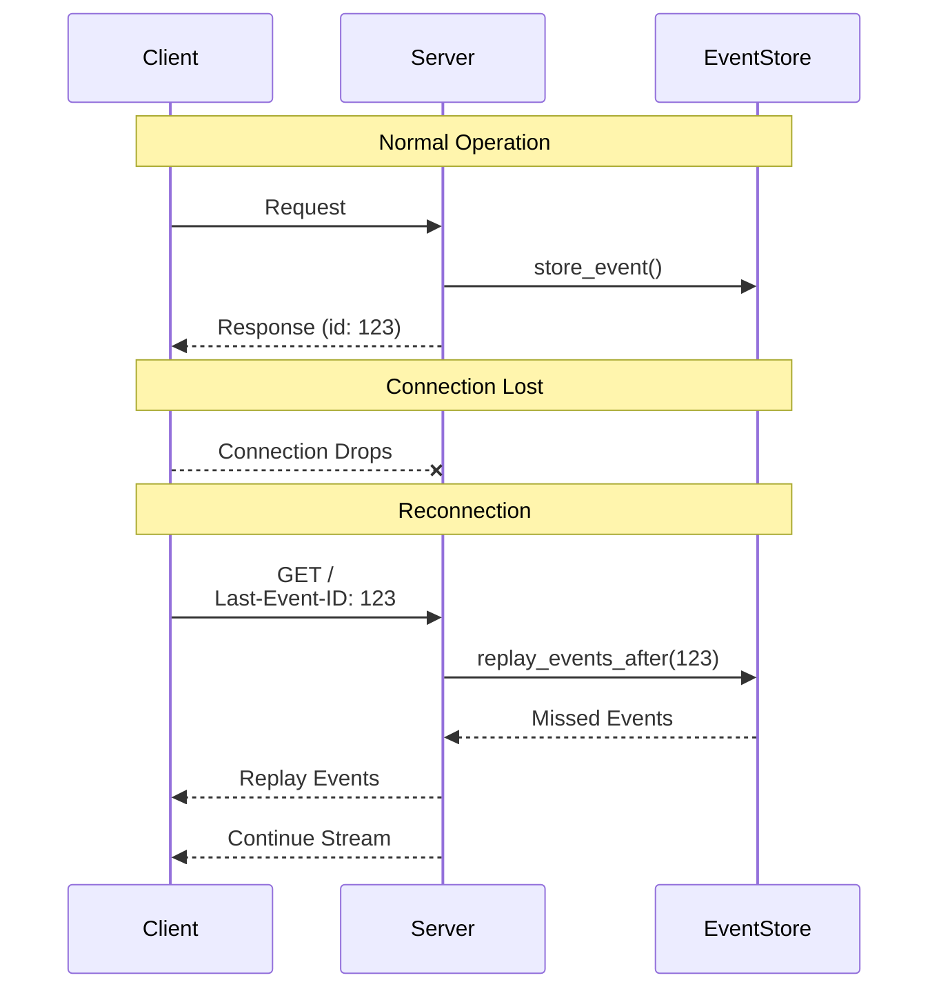
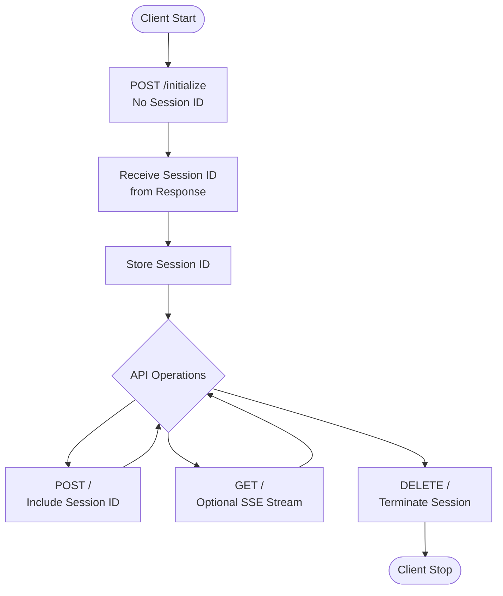
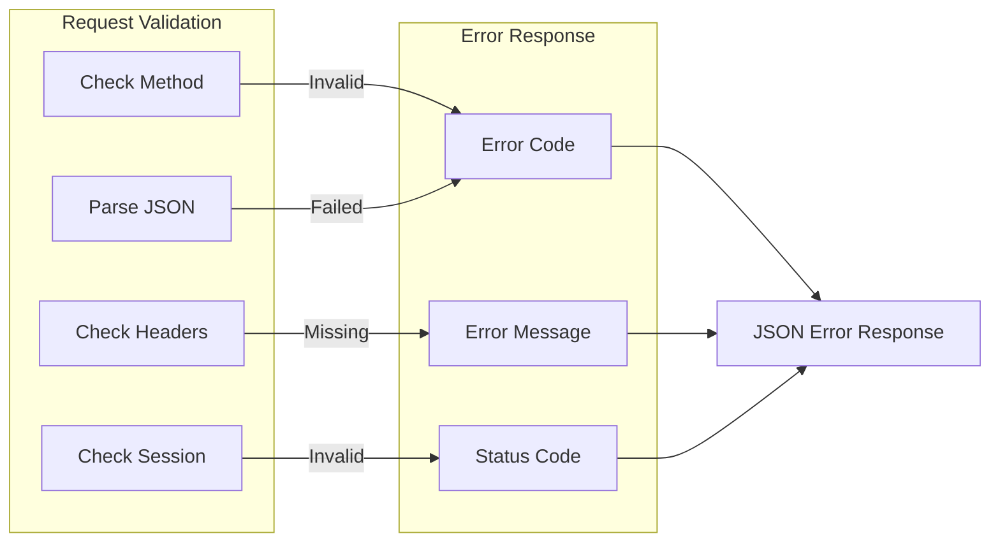

# MCP HTTP Streamable Server API Specification

## Executive Summary

The MCP (Model Context Protocol) HTTP Streamable Server provides a robust transport layer for bidirectional communication between MCP clients and servers using HTTP with Server-Sent Events (SSE). It supports both stateful session-based connections and stateless operation modes, with optional resumability through event stores.

## Architecture Overview



## Core Components

### 1. Transport Layer

- **StreamableHTTPServerTransport**: Main transport implementation
- **StreamableHTTPSessionManager**: Session lifecycle management
- **EventStore**: Optional interface for resumability

### 2. Communication Modes



## API Endpoints

### POST / - Send Messages

Sends JSON-RPC messages to the server and receives responses.



**Request Requirements:**

- Headers:
  - `Content-Type: application/json`
  - `Accept: application/json, text/event-stream`
  - `mcp-session-id: <session-id>` (except for initialize)
  - `mcp-protocol-version: 2025-03-26` (optional)

**Response Types:**
| Mode | Content-Type | Use Case |
|------|--------------|----------|
| SSE | `text/event-stream` | Real-time streaming responses |
| JSON | `application/json` | Simple request-response |

### GET / - Server Stream

Establishes a standalone SSE stream for server-initiated messages.



**Features:**

- One GET stream per session maximum
- Supports resumability via `Last-Event-ID` header
- Server can send notifications and requests

### DELETE / - Terminate Session

Explicitly terminates a session and closes all associated streams.



## Session Lifecycle



## Headers Reference

### Request Headers

| Header                 | Required   | Description                                             |
| ---------------------- | ---------- | ------------------------------------------------------- |
| `mcp-session-id`       | Yes\*      | Session identifier (ASCII 0x21-0x7E)                    |
| `mcp-protocol-version` | No         | Protocol version (default: 2025-03-26)                  |
| `Accept`               | Yes (POST) | Must include `application/json` and `text/event-stream` |
| `Content-Type`         | Yes (POST) | Must be `application/json`                              |
| `Last-Event-ID`        | No         | Resume SSE stream from specific event                   |

\*Not required for initialize requests

### Response Headers

| Header           | Description                               |
| ---------------- | ----------------------------------------- |
| `mcp-session-id` | Session ID (if active)                    |
| `Content-Type`   | `application/json` or `text/event-stream` |
| `Cache-Control`  | `no-cache, no-transform` (SSE)            |
| `Connection`     | `keep-alive` (SSE)                        |

## Status Codes



## Configuration Options

```python
# Basic Configuration
StreamableHTTPServerTransport(
    mcp_session_id=None,              # Auto-generate if None
    is_json_response_enabled=False,   # Use JSON instead of SSE
    event_store=None,                 # Enable resumability
    security_settings=None            # DNS rebinding protection
)

# Session Manager Configuration
StreamableHTTPSessionManager(
    app=mcp_server,                   # MCP Server instance
    event_store=event_store,          # Optional resumability
    json_response=False,              # Response mode
    stateless=False,                  # Session mode
    security_settings=settings        # Security config
)
```

## Resumability with Event Store



## Implementation Example

### Server Setup

```python
from mcp.server.fastmcp import FastMCP
from starlette.applications import Starlette
from starlette.routing import Mount

# Create MCP server
mcp = FastMCP("My MCP Server")

# Define tools
@mcp.tool()
def hello(name: str) -> str:
    """Say hello to someone"""
    return f"Hello, {name}!"

# Mount as ASGI application
app = Starlette(
    routes=[
        Mount("/mcp", app=mcp.streamable_http_app())
    ]
)

# Run with: uvicorn app:app --reload
```

### Client Connection Flow



## Security Features

### DNS Rebinding Protection

- Validates Host headers against allowed origins
- Configurable via `TransportSecuritySettings`
- Prevents malicious redirects

### Session Security

- Session IDs use visible ASCII characters only (0x21-0x7E)
- Validation pattern: `^[\x21-\x7E]+$`
- Sessions isolated from each other

### Protocol Versioning

- Negotiated during initialization
- Supports version compatibility checks
- Default: `2025-03-26`

## Performance Considerations

### Stateful Mode

- ✅ Session persistence
- ✅ Event store support
- ✅ Multiple concurrent streams
- ❌ Higher memory usage
- **Use for:** Traditional server deployments

### Stateless Mode

- ✅ No session overhead
- ✅ Scales horizontally
- ✅ Serverless compatible
- ❌ No resumability
- **Use for:** Serverless, edge computing

## Error Handling



## Best Practices

1. **Session Management**

   - Always store session IDs securely
   - Implement proper cleanup on disconnect
   - Use event stores for critical applications

2. **Error Recovery**

   - Implement exponential backoff for reconnections
   - Store Last-Event-ID for resumability
   - Handle all HTTP status codes

3. **Performance**

   - Use JSON mode for simple request-response
   - Implement connection pooling
   - Monitor stream health

4. **Security**
   - Enable DNS rebinding protection
   - Validate all inputs
   - Use HTTPS in production

## Conclusion

The MCP HTTP Streamable Server provides a flexible, scalable transport layer for MCP applications. With support for both stateful and stateless operations, SSE streaming, and optional resumability, it can adapt to various deployment scenarios from traditional servers to modern serverless architectures.
